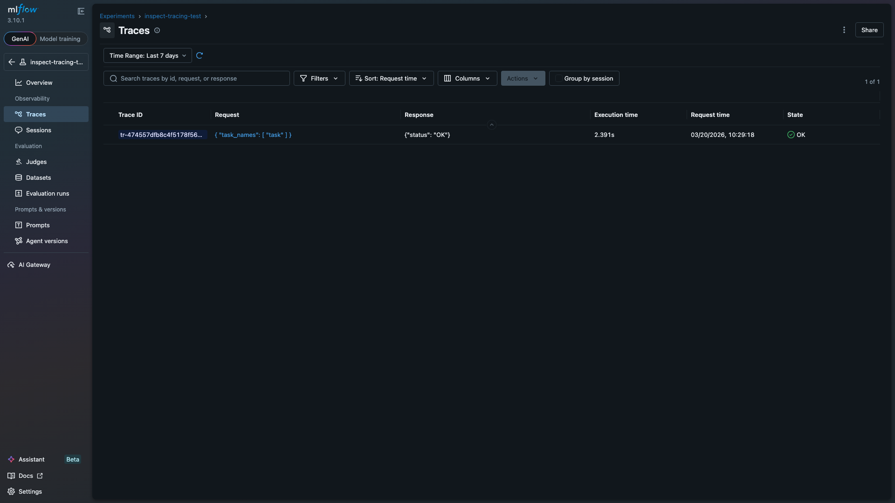
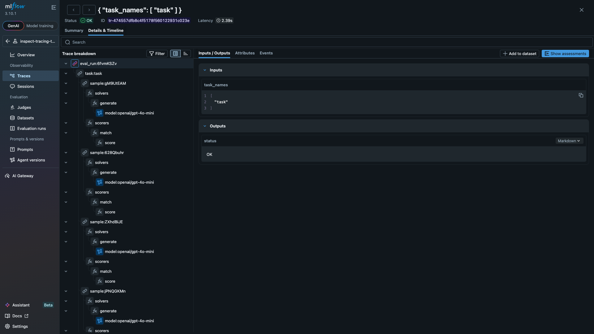
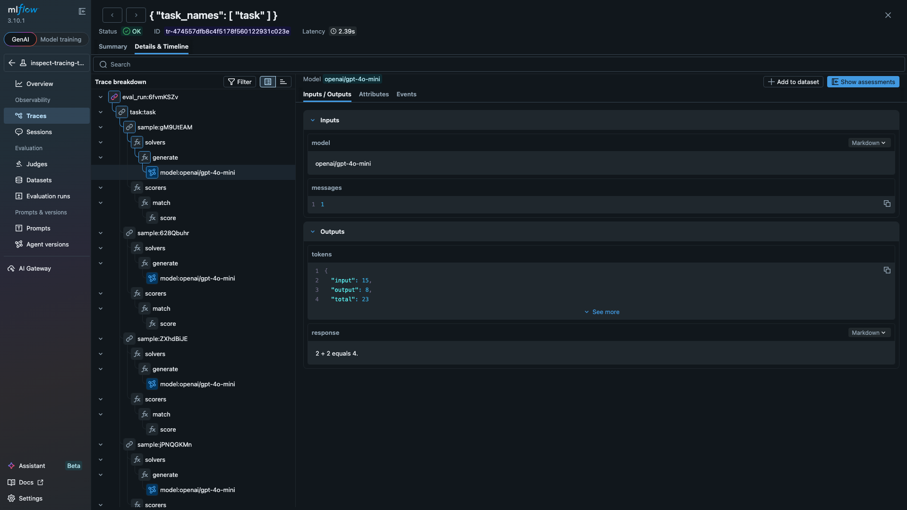

# inspect-mlflow


[](https://github.com/debu-sinha/inspect-mlflow/actions/workflows/ci.yml)
[](https://github.com/debu-sinha/inspect-mlflow/actions/workflows/codeql.yml)
[](https://www.python.org/downloads/)
[](https://opensource.org/licenses/MIT)

MLflow integration for [Inspect AI](https://inspect.aisi.org.uk/). Provides experiment tracking, execution tracing, and artifact logging for Inspect AI evaluations.

## Install

```bash
pip install inspect-mlflow
```

## Quick Start

No code changes needed. Install the package, set env vars, and run evals as usual.

```bash
# Start MLflow server
mlflow server --port 5000

# Set env vars
export MLFLOW_TRACKING_URI="http://localhost:5000"
export MLFLOW_INSPECT_TRACING="true"

# Run evals. Hooks auto-activate.
inspect eval my_task.py --model openai/gpt-4o
```

Then open http://localhost:5000 to see runs and traces.

## What it does

### Tracking Hook

Activated when `MLFLOW_TRACKING_URI` is set. Creates hierarchical MLflow runs mirroring the eval structure.

- Parent run per eval invocation, nested child runs per task
- Task config logged as parameters (model, dataset, solver, temperature)
- Per-sample scores as step metrics
- Model token usage (input/output/total per model)
- Real-time event counting (model calls, tool calls)
- Eval artifacts: per-sample results JSON + full eval log JSON

### Tracing Hook

Activated when `MLFLOW_INSPECT_TRACING=true` is also set. Maps eval execution to MLflow trace spans.

```
eval_run:6fvmKSZv (CHAIN)
  task:task (CHAIN)
    sample:gM9UtEAM (CHAIN)
      solvers -> generate -> model:openai/gpt-4o-mini (LLM)
      scorers -> match -> score (EVALUATOR)
    sample:628Qbuhr (CHAIN)
      ...
```

Each span captures relevant data:

| Span Type | Data |
|-----------|------|
| LLM | model name, token counts, temperature, cache, response |
| TOOL | function name, arguments, result, errors |
| EVALUATOR | score value, explanation, target |

## Screenshots

**Traces list** showing an eval run with execution time and status:



**Full span tree** showing the eval hierarchy (eval_run -> task -> samples -> solvers/scorers):



**LLM span detail** with model name, token counts, and response text:



## Configuration

| Env var | Required | Default | Description |
|---------|----------|---------|-------------|
| `MLFLOW_TRACKING_URI` | Yes | - | MLflow server URL |
| `MLFLOW_EXPERIMENT_NAME` | No | `inspect_ai` | Experiment name |
| `MLFLOW_INSPECT_TRACING` | No | `false` | Enable execution tracing |
| `MLFLOW_INSPECT_LOG_ARTIFACTS` | No | `true` | Log eval artifacts |

## Example

```python
from inspect_ai import Task, eval
from inspect_ai.dataset import Sample
from inspect_ai.scorer import match
from inspect_ai.solver import generate

# No special imports needed. Hooks auto-register on install.

task = Task(
    dataset=[
        Sample(input="What is 2 + 2?", target="4"),
        Sample(input="What is 3 * 5?", target="15"),
        Sample(input="What is 10 - 7?", target="3"),
    ],
    solver=generate(),
    scorer=match(),
)

logs = eval(task, model="openai/gpt-4o-mini")
# Results are now in MLflow: runs with metrics + traces with spans
```

## Development

```bash
git clone https://github.com/debu-sinha/inspect-mlflow.git
cd inspect-mlflow
uv sync --group dev
uv run pre-commit install
uv run pytest tests/ -v
```

See [CONTRIBUTING.md](CONTRIBUTING.md) for details.

## Related

- [Inspect AI](https://inspect.aisi.org.uk/) - AI evaluation framework by UK AISI
- [MLflow](https://mlflow.org/) - ML experiment tracking and model management
- [Inspect AI hooks docs](https://inspect.aisi.org.uk/extensions.html#sec-hooks) - How hooks work
- [Issue #3547](https://github.com/UKGovernmentBEIS/inspect_ai/issues/3547) - Original proposal
